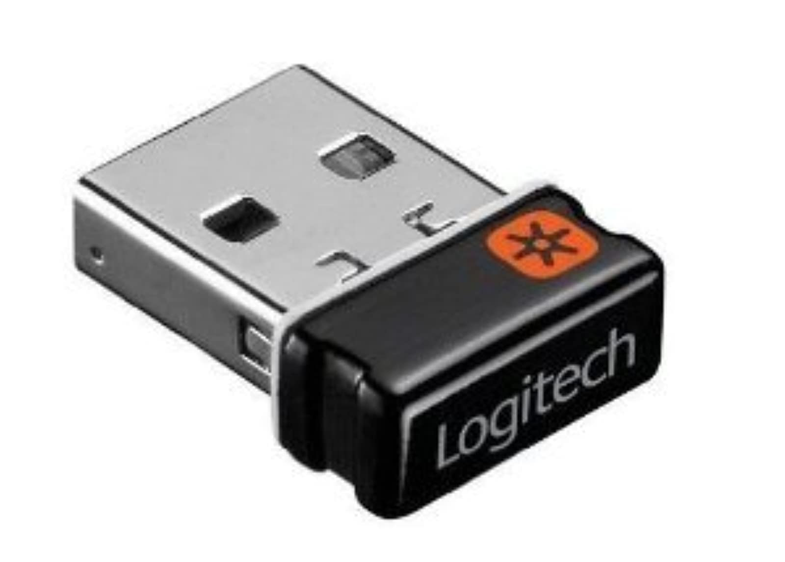
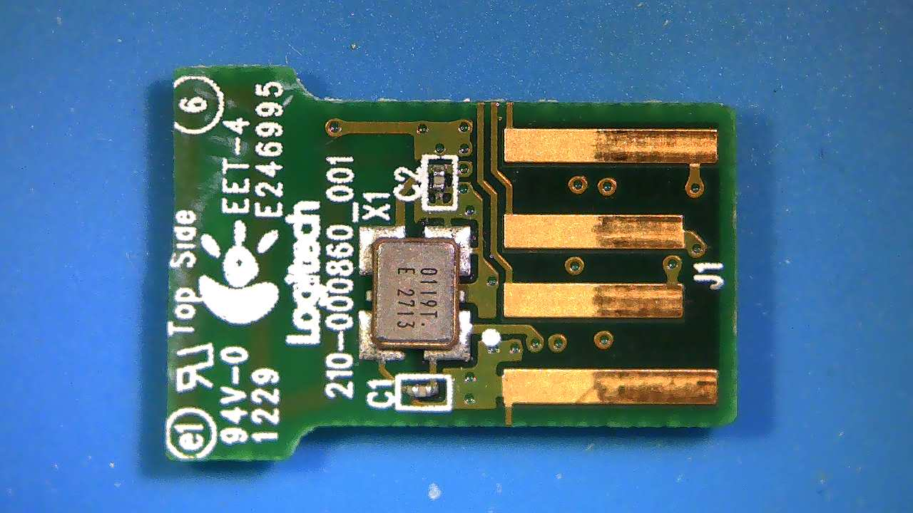
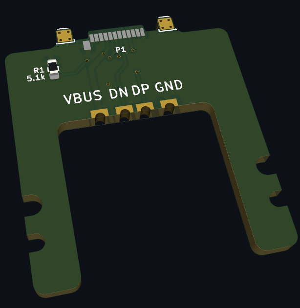

# Logitech Unifying Reciever Adapter

Some Logitech mice still require a proprietary USB-A dongle. 
Ripping off the enclosure, the USB contacts are on the PCB.
This is a simple adapter with castellated holes to hide the recievers inside a Framework Expansion Card. 

